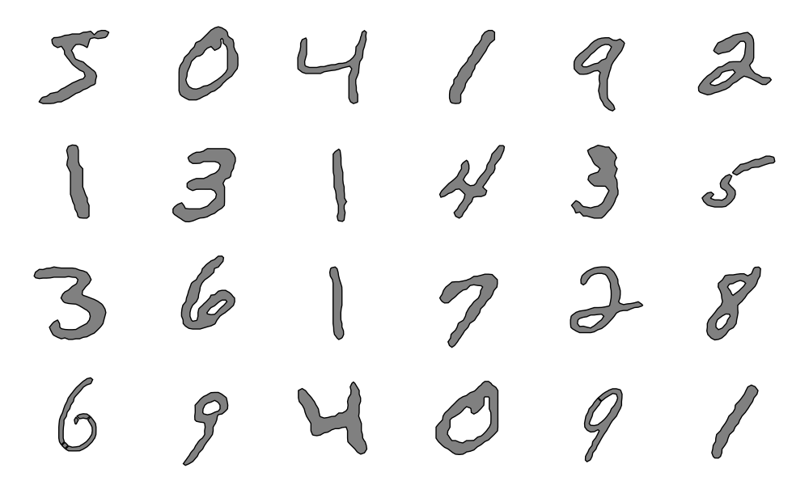

PolygonMNIST
============
[MNIST](http://yann.lecun.com/exdb/mnist/) digits represented as polygons.




The PolygonMNIST maintains the same order as MNIST.
To download run:
```shell
wget https://github.com/jenkspt/polygon-mnist/raw/main/polygon_mnist.npz
```

The data can be loaded using [shapely](https://shapely.readthedocs.io/en/stable/manual.html).

```python
import numpy as np
import shapely.wkb

with np.load('polygon_mnist.npz') as data:
    train_polygons = shapely.wkb.loads(data['x_train'])     # --> shapely.GeometryCollection
    train_labels = data['y_train']                          # --> numpy array (just like mnist)
    test_polygons = shapely.wkb.loads(data['x_test'])       # --> shapely.GeometryCollection
    train_labels = data['y_train']                          # --> numpy array (just like mnist)
```
Use `train_polygons.geoms` to get the sequence of digit polygons, where each digit can be a `shapely.Polygon` or `shapely.MultiPolygon`.
Each polygon has coordinates in range [0, 1]

Polygons are extracted from MNIST images using marching squares (marching cubes for 2D) using [prepare.py](prepare.py).

### Prepare the dataset yourself
```shell
wget https://storage.googleapis.com/tensorflow/tf-keras-datasets/mnist.npz
python prepare.py
```

# Citations

```bibtex
@article{lecun2010mnist,
  title={MNIST handwritten digit database},
  author={LeCun, Yann and Cortes, Corinna and Burges, CJ},
  journal={ATT Labs [Online]. Available: http://yann.lecun.com/exdb/mnist},
  volume={2},
  year={2010}
}
```